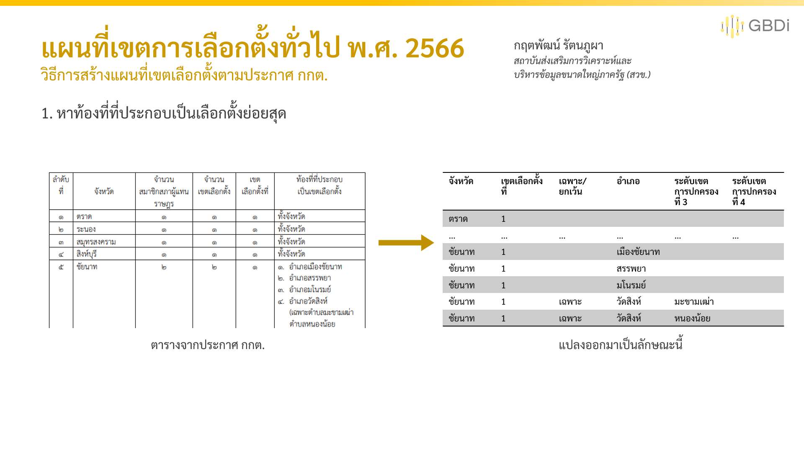
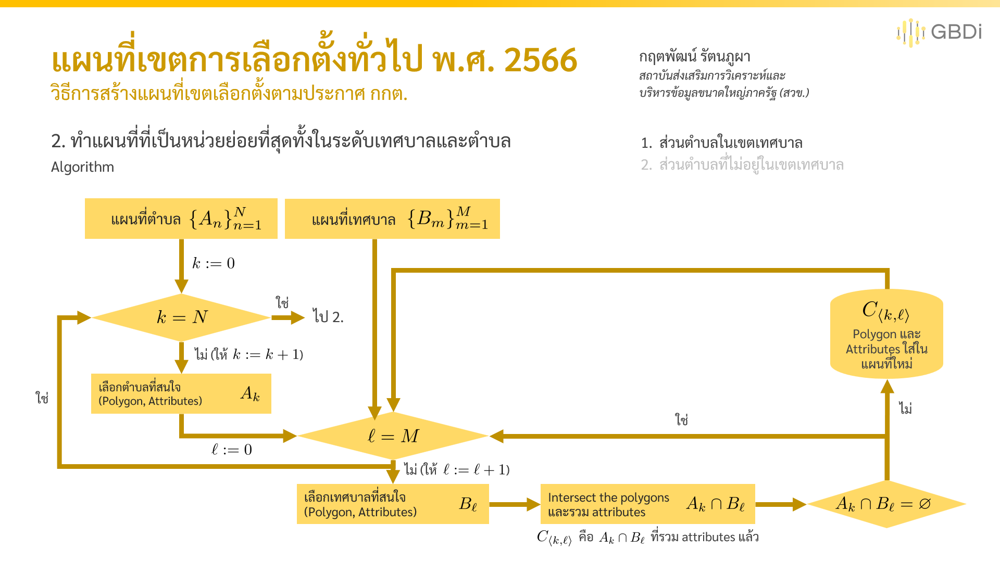

# แผนที่เขตการเลือกตั้งทั่วไป พ.ศ. 2566

*กฤตพัฒน์ รัตนภูผา*

สถาบันส่งเสริมการวิเคราะห์และบริหารข้อมูลขนาดใหญ่ภาครัฐ (GBDi)

วันมหาสงกรานต์ พ.ศ. 2566

---

หากพบว่าข้อมูลมีความไม่ถูกต้อง
- สามารถเปิด issues ได้ใน repository นี้ได้เลย
- สามารถติดต่อมายังอีเมลล์ kittapat.ra@depa.or.th

---

แผนที่เขตการเลือกตั้งนี้เป็นแผนที่ที่จัดทำเพื่อนำไปใช้เกี่ยวกับการรายงานผลการเลือกตั้งแบบไม่เป็นทางการสมาชิกสภาผู้แทนราษฎรเป็นการทั่วไปในวันที่ 14 พฤษภาคม 2566 โดยใน repository นี้จะประกอบด้วยไฟล์ดังต่อไปนี้

1. ESRI ShapeFile เขตการเลือกตั้ง
2. SVG files เขตการเลือกตั้งของแต่ละจังหวัด ซึ่งสามารถ access element ได้โดย `g` เป็นชื่อจังหวัดและ `id` เป็นเลขเขตการเลือกตั้ง
3. GeoJSON ขอบเขตเทศบาล
4. GeoJSON ขอบเขตตำบลในประเทศไทยและแขวงในกรุงเทพมหานคร
5. GeoJSON ขอบเขตที่ถูกซอยย่อยในเขต/นอกเขตเทศบาลในระดับตำบล

โดยไฟล์เหล่านี้สามารถใช้ได้เพื่อเป็นประโยชน์ทางสาธารณะซึ่ง “สิทธิการใช้ข้อมูลภายใต้ข้อกำหนดการให้ใช้ข้อมูลของศูนย์กลางข้อมูลเปิดภาครัฐ” (DGA open government license)

[ข้อกำหนดและเงื่อนไขการให้ใช้ข้อมูลของศูนย์กลางข้อมูลเปิดภาครัฐ (Terms and Conditions for DGA Open Government License) - Open Government Data of Thailand](https://data.go.th/pages/dga-open-government-license)

ไฟล์เหล่านี้จัดเป็นมาตรฐานเพื่อให้สามารถเข้าถึงได้อย่างสะดวกยิ่งขึ้น โดยมีรหัส

1. PAT code: รหัสจังหวัด ตำบล อำเภอตามที่กำหนดโดยกรมการปกครอง มท.
2. DLA code: รหัสเทศบาลตามที่กำหนดโดยกรมส่งเสริมการปกครองท้องถิ่น มท.

*หมายเหตุ* แผนที่เหล่านี้ไม่สามารถนำไปใช้ในการอ้างอิงตามกฎหมายได้ เป็นเพียงการประมาณเท่านั้น

## หลักการเบื้องหลังในการสร้างแผนที่เขตเลือกตั้งตามประกาศ กกต.

เขตการเลือกตั้งอ้างอิงจากราชกิจจานุเบกษา (อ้างอิง: [ประกาศคณะกรรมการการเลือกตั้ง จำนวนสมาชิกสภาผู้แทนราษฎรแบบแบ่งเขตเลือกตั้งที่แต่ละจังหวัดจะพึงมี และจำนวนเขตเลือกตั้งแบบแบ่งเขตเลือกตั้งของแต่ละจังหวัด (soc.go.th)](https://ratchakitcha.soc.go.th/documents/140A023N0000000000500.pdf))

จำนวน ส.ส. พึงมีในแต่ละจังหวัด (อ้างอิง: [ประกาศคณะกรรมการการเลือกตั้ง เรื่อง จำนวนสมาชิกสภาผู้แทนราษฎรแบบแบ่งเขตเลือกตั้งและเขตเลือกตั้งของแต่ละจังหวัด สำหรับการเลือกตั้งสมาชิกสภาผู้แทนราษฎรเป็นการทั่วไปครั้งแรก ภายหลังประกาศใช้รัฐธรรมนูญแห่งราชอาณาจักรไทย แก้ไขเพิ่มเติม (ฉบับที่ ๑) พุทธศักราช ๒๕๖๔ (soc.go.th)](https://ratchakitcha.soc.go.th/documents/140A008N0000000003102.pdf))

การแบ่งเขตการการเลือกตั้งจะมี 2 หลักเกณฑ์ในการพิจารณา
1. จำนวน ส.ส. พึงมีในจังหวัดต่าง ๆ (อ้างอิง: [พระราชบัญญัติประกอบรัฐธรรมนูญ ว่าด้วยการเลือกตั้งสมาชิกสภาผู้แทนราษฎร (ฉบับที่ ๒) พ.ศ. ๒๕๖๖ (soc.go.th)](https://ratchakitcha.soc.go.th/documents/140A007N0000000000100.pdf))

2. การแบ่งเขตให้ได้ตามจำนวน ส.ส. พึงมีในจังหวัด (อ้างอิง: [พระราชบัญญัติประกอบรัฐธรรมนูญ ว่าด้วยการเลือกตั้งสมาชิกสภาผู้แทนราษฎร พ.ศ. ๒๕๖๑ (soc.go.th)](https://ratchakitcha.soc.go.th/documents/2147915.pdf))

### จำนวน ส.ส. พึงมีในจังหวัด
ตามมาตรา 6 พ.ร.ป. รัฐธรรมนูญว่าด้วยการเลือกตั้ง ส.ส. (ฉบับที่ 2) พ.ศ. 2566 กล่าวไว้ดังนี้

มาตรา ๖ ให้ยกเลิกความในมาตรา ๒๖ แห่งพระราชบัญญัติประรัฐธรรมนูญว่าด้วยการเลือกตั้งสมาชิกสภาผู้แทนราษฎร พ.ศ. ๒๕๖๑ และให้ใช้ความต่อไปนี้แทน

"มาตรา ๒๖ การกำหนดจำนวนสมาชิกสภาผู้แทนราษฎรที่แต่ละจังหวัดจะพึงมีและการแบ่งเขตเลือกตั้ง ให้ดำเนินการตามวิธีการ ดังต่อไปนี้

(๑) ให้ใช้จำนวนราษฎรทั้งประเทศตามหลักฐานการทะเบียนราษฎรที่ประกาศปีสุดท้ายก่อนปีที่มีการเลือกตั้ง เฉลี่ยด้วยจำนวนสมาชิกสภาผู้แทนราษฎรสี่ร้อยคน จำนวนที่ได้รับให้ถือว่าเป็นจำนวนราษฎรต่อสมาชิกหนึ่งคน

(๒) จังหวัดใดมีราษฎรไม่ถึงเกณฑ์จำนวนราษฎรต่อสมาชิกหนึ่งคนตาม (๑) ให้มีสมาชิกสภาผู้แทนราษฎรในจังหวัดนั้นได้หนึ่งคน โดยให้ถือเขตจังหวัดเป็นเขตเลือกตั้ง

(๓) จังหวัดใดมีราษฎรเกินจำนวนราษฎรต่อสมาชิกหนึ่งคน ให้มีสมาชิกสภาผู้แทนราษฎรในจังหวัดนั้นเพิ่มขึ้นอีกหนึ่งคนทุกจำนวนราษฎรที่ถึงเกณฑ์จำนวนราษฎรต่อสมาชิกหนึ่งคน

(๔) เมื่อได้จำนวนสมาชิกสภาผู้แทนราษฎรของแต่ละจังหวัดตาม (๒) และ (๓) แล้วถ้าจำนวนสมาชิกสภาผู้แทนราษฎรยังไม่ครบสี่ร้อยคน และให้เพิ่มสมาชิกสภาผู้แทนราษฎรตามวิธีการดังกล่าวแก่จังหวัดที่มีเศษที่เหลือจากการคำนวณนั้นในลำดับรองลงมาตามลำดับจนครบสี่ร้อยคน

(๕) จังหวัดใดมีการเลือกตั้งได้เกินหนึ่งคน ให้แบ่งเขตจังหวัดออกเป็นเขตเลือกตั้นเท่าจำนวนสมาชิกสภาผู้แทนราษฎรพึงมี **โดยต้องแบ่งพื้นที่ของเขตเลือกตั้งแต่ละเขตให้ติดต่อกันและต้องจัดให้มีจำนวนราษฎรในแต่ละเขตใกล้เคียงกัน**"

### การแบ่งเขตเลือกตั้งตามจำนวน ส.ส. พึงมี
ตามมาตรา 27 พ.ร.ป. รัฐธรรมนูญว่าด้วยการเลือกตั้ง ส.ส. พ.ศ. 2561 กล่าวไว้ดังนี้

มาตรา ๒๗ ให้คณะกรรมการดำเนินการแบ่งเขตเลือกตั้งสำหรับการเลือกตั้งแบบแบ่งเขตเลือกตั้งไว้ทุกจังหวัด เพื่อให้ประชาชนได้ทราบล่วงหน้าซึ่งจะต้องกำหนดตามหลักเกณฑ์ที่บัญญัติไว้ในมาตรา ๒๖ และต้องแบ่งพื้นที่ของเขตเลือกตั้งแต่ละเขตให้ติดต่อกันและต้องจัดให้มีจำนวนราษฎรในแต่ละเขตเลือกตั้งใกล้เคียงกัน โดยถือเกณฑ์ดังต่อไปนี้

(๑) ให้รวมอำเภอต่าง ๆ เป็นเขตเลือกตั้ง โดยคำนึงถึงพื้นที่ที่ติดต่อใกล้ชิดกัน ความสะดวกในการคมนาคมระหว่างกัน และการเคยอยู่ในเขตเลือกตั้งเดียวกัน ถ้าการรวมอำเภอในลักษณะนี้จะทำให้มีจำนวนราษฎรมากหรือน้อยเกินไป ให้แยกตำบลของอำเภอออกเพื่อให้ได้จำนวนราษฎรพอเพียงสำหรับการเป็นเขตเลือกตั้ง แต่จะแยกหรือรวมเฉพาะเพียงบางส่วนของตำบลไม่ได้

(๒) ในกรณีที่การกำหนดพื้นที่ตามเกณฑ์ใน (๑) จะทำให้จำนวนราษฎรในแต่ละเขตเลือกตั้งมีจำนวนไม่ใกล้เคียงกันหรือไม่มีสภาพเป็นชุมชนเดียวกัน ให้ดำเนินการแบ่งเขตเลือกตั้งตามสภาพของชุมชนที่ราษฎรมีการติดต่อกันเป็นประจำในลักษณะที่เป็นชุมชนเดียวกันหรือใกล้เคียงกันและสามารถเดินทางติดต่อกันได้โดยสะดวก โดยจะต้องทำให้จำนวนราษฎรมีจำนวนใกล้เคียงกับมากที่สุด

(๓) เปิดโอกาสให้พรรมการเมืองและประชาชนมีส่วนร่วมแสดงความคิดเห็นเพื่อประกอบการพิจารณาเกี่ยวกับการแบ่งเขตเลือกตั้งตาม (๑) และ (๒) ทั้งนี้ ตามหลักเกณฑ์และวิธีการที่คณะกรรมการกำหนด

### เบื้องหลัง Algorithm ที่ไว้ใช้สร้างแผนที่ตามประกาศ กกต. กำหนด

แผนที่ที่ใช้มีดังต่อไปนี้

- แผนที่ระดับตำบลในประเทศไทย (GISTDA: [L05_Tambon_GISTDA_50k - Overview](https://gistdaportal.gistda.or.th/portal/home/item.html?id=635097fec40c4b72ad2d1a534071fffb), แผนที่อ้างอิงจากกรมแผนที่ทหาร: [Thailand - Subnational Administrative Boundaries - Humanitarian Data Exchange (humdata.org)](https://data.humdata.org/dataset/cod-ab-tha))
- แผนที่เทศบาลในประเทศไทย
- แผนที่กรุงเทพมหานคร ([BANGKOK GIS ศูนย์เทคโนโลยีสารสนเทศภูมิศาสตร์กรุงเทพมหานคร](http://www.bangkokgis.com/modules.php?m=download_shapefile))
รวมถึงตารางรหัสเทศบาลตำบล (DLA code; [รหัสเทศบาล (กรมส่งเสริมการปกครองท้องถิ่น)](http://www.dla.go.th/work/orginfo.pdf))

ซึ่งอุปกรณ์ที่ใช้ในการสร้างแผนที่มีดังต่อไปนี้
- Python: GeoPandas, shapely, difflib (เนื่องจาก PDF ที่ใช้มีการ encode ผิดเล็กน้อย)
- QGIS: PyQGIS, Saga-GIS, Vector Layer Management
- Mapshaper [mbloch/mapshaper: Tools for editing Shapefile, GeoJSON, TopoJSON and CSV files (github.com)](https://github.com/mbloch/mapshaper)

นอกจากนี้จะมีขั้นตอนในการแยกจังหวัด (โดยใช้ QGIS) และบันทึกข้อมูลเป็น .svg (โดย MapShaper) เพื่อสะดวกในการพัฒนาเว็บผลการเลือกตั้ง
